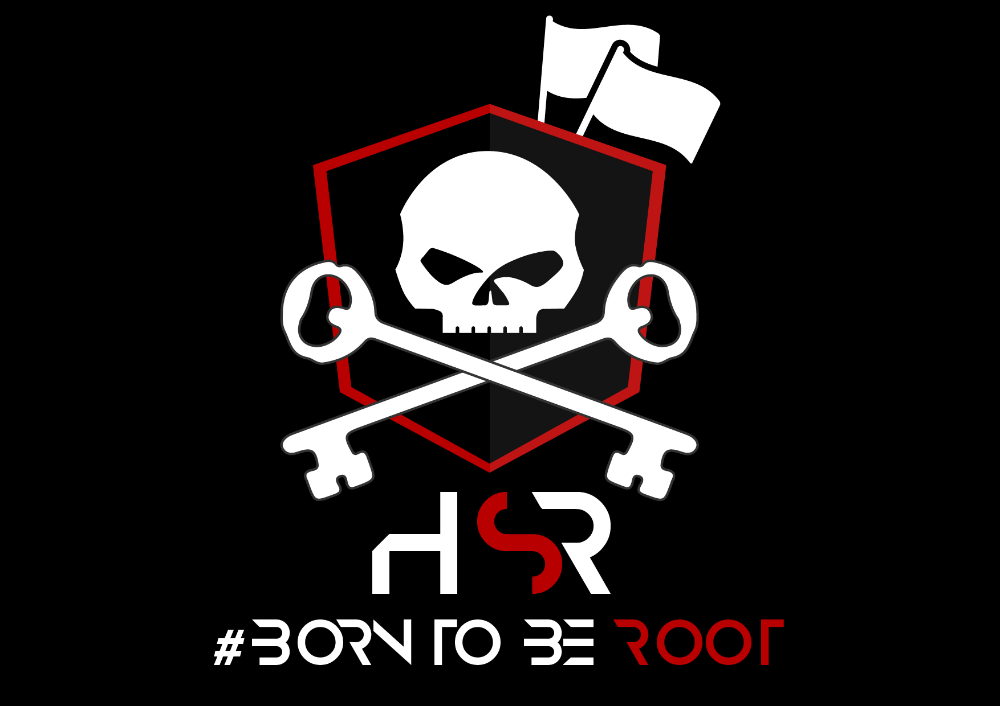
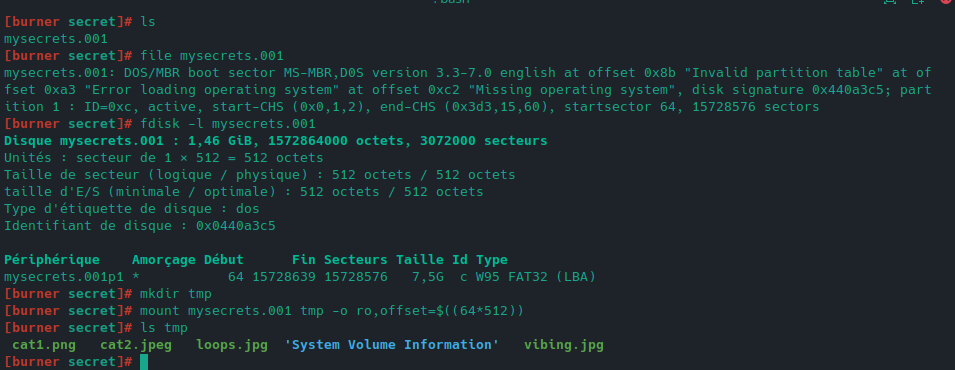

# Intro

HSR est l'un des toutes premiers évènements dédiés aux étudiants français. Cette année, pour la 6ème édition, nous étions 150 pour le CTF.

Voici pour commencer un défi sympa que j'ai eu l'occasion de faire au [**HackSecuReims**](https://www.hacksecureims.eu/).

Nous avons une image secret.png un peu lourde, l'énoncé nous dit que le flag se situera à côté d'une mention 'passwd'.

## Extraction zip

On extrait donc son contenu:

`binwalk -e secret.png`

On obtient un zip, qu'on essaie de dézipper avec 7zip au vu de la version, mais protégé par mot de passe:

## Crack avec john

On utilise `zip2john` pour donner à john le hash du mot de passe sous un format qu'il connaît.
On le casse avec john, le mot de passe est **icecream**.
Le dossier secret extrait nous révèle un fichier *mysecrets.001*:

## Inspection du disque

Le fichier est en fait un disque logique DOS/MBR.
Pour le monter dans un dossier tmp, on effectue un `fdisk -l` afin de connaître le début et la taille de chaque secteur.
On utilise `mount`, mais à part des photos de chats, rien d'intéressant.

## Récupération de fichiers effacés

En pratique j'avais sauté l'étape précédente.
On peut utiliser `photorec` (paquet testdisk) pour faire du file carving:

## Flag

Un dossier recupdir apparaît avec une image:

C'est le flag!

